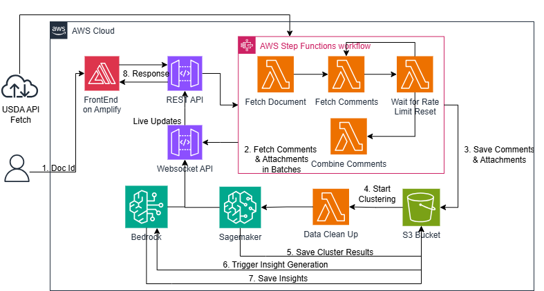

# USDA Public Comment Analysis System

A serverless application for analyzing public comments from regulations.gov using advanced NLP techniques, clustering, and AI-powered insights.

## Project Overview

The USDA Public Comment Analysis system ingests public comments from regulations.gov, processes them using advanced natural language processing techniques, and generates insightful reports that include topic modeling, sentiment analysis, and detection of AI-generated content. This system assists USDA staff in efficiently analyzing public feedback on proposed regulations.



## Key Features

- **Comment Processing**: Retrieves and processes comments and attachments from regulations.gov API
- **Content Clustering**: Groups similar comments using semantic similarity
- **Sentiment Analysis**: Determines positive, neutral, or negative sentiment by cluster
- **Insight Generation**: AI-powered summarization and action recommendations
- **AI Content Detection**: Flags potentially AI-generated comments for review
- **Real-time Progress Updates**: WebSocket-based progress monitoring
- **Interactive UI**: React frontend for submission and result visualization

## Architecture

The system follows a serverless architecture on AWS:

- **Frontend**: React application deployed on AWS Amplify
- **API Layer**: REST API (API Gateway + Lambda) for submissions and results
- **Real-time Updates**: WebSocket API for progress notifications
- **Processing Pipeline**: Step Functions workflow for orchestration
- **ML Processing**: SageMaker for clustering and Amazon Bedrock for analysis
- **Storage**: S3 for comment data and DynamoDB for state management
- **Infrastructure**: Defined with AWS CDK in TypeScript

## Prerequisites

- AWS account with sufficient permissions
- AWS CLI installed and configured
- Node.js (v14 or higher) and npm
- AWS CDK installed globally
- Regulations.gov API key
- Access to Amazon Bedrock with Claude 3.5 Sonnet model enabled
- GitHub account with access to the repository
- GitHub personal access token with repository permissions

## Deployment

### Preparing Secrets

#### Creating GitHub Access Token

1. In GitHub: Settings > Developer settings > Personal access tokens
2. Generate a new token with `repo` and `admin:repo_hook` scopes
3. Store in AWS Secrets Manager as `github-token`

### Enabling Amazon Bedrock Model Access

1. In AWS Console, navigate to Amazon Bedrock
2. Go to "Model access" and click "Manage model access"
3. Enable "Anthropic Claude 3.5 Sonnet" model

### Deployment Steps

1. Configure AWS CLI:
   ```bash
   aws configure
   ```

2. Clone the repository:
   ```bash
   git clone https://github.com/ASUCICREPO/public-comment-analysis.git
   cd public-comment-analysis
   ```

3. Install global and project dependencies:
   ```bash
   npm install -g aws-cdk
   npm install
   ```

4. Bootstrap your AWS environment:
   ```bash
   cdk bootstrap
   ```

5. Deploy all stacks:
   ```bash
   cdk deploy --all
   ```

6. Note the outputs (API URLs and Amplify application URL)

## Usage

1. Access the Amplify application URL from deployment outputs
2. Enter a document ID from regulations.gov
3. Click "Add to Queue" followed by "Generate Insights"
4. Monitor real-time progress in the UI
5. View analysis results when processing completes

## Stack Architecture

The project consists of the following CDK stacks:

- **PublicCommentAnalysisStack**: Core document processing pipeline
- **WebSocketStack**: Real-time communication infrastructure
- **RestApiStack**: HTTP endpoints for frontend interaction
- **ClusteringStack**: Comment clustering and analysis pipeline
- **ECRStack**: Container infrastructure for processing
- **AmplifyStack**: Frontend application deployment
- **TestLambdaStack**: End-to-end testing resources

## Technical Implementation

### Clustering Algorithm

The system employs semantic clustering using:
- SentenceTransformer embeddings (`all-MiniLM-L6-v2` model)
- K-means clustering with silhouette score evaluation
- Text preprocessing and deduplication
- Attachment content extraction and integration

### Analysis Generation

Insights are generated using:
- Amazon Bedrock with Claude 3.5 Sonnet
- Structured prompt engineering for consistent JSON output
- Multi-perspective analysis (sentiment, actions, organizations)
- Representative comment extraction

### API Implementation

- **REST API**: Document submission and status checking
- **WebSocket API**: Real-time progress notifications
- **State Management**: Comprehensive processing state tracking
- **Error Handling**: Graceful degradation and informative errors

## Development

### Project Structure

```
public-comment-analysis/
├── bin/                    # CDK application entry point
├── lib/                    # CDK stack definitions
├── lambda/                 # Lambda function code
│   ├── initializer/        # Document validation
│   ├── processor/          # Comment processing
│   ├── clustering-analyzer/# Analysis generation
│   └── ...
├── docker/                 # Container definitions
├── frontend/               # React frontend application
└── scripts/                # Utility scripts
```


### Recent Improvements
The latest updates focus on improving **pipeline reliability**, **frontend accuracy**, and **workflow efficiency** across the clustering and analysis system.

#### Pipeline Fixes 
- Fixed SageMaker clustering failures by granting **full read/write S3 permissions**:
  - `s3:GetObject`, `s3:PutObject`, `s3:ListBucket`
  - `s3:DeleteObject`, `s3:GetObjectVersion`
- Ensured SageMaker can read and write to the clustering bucket, preventing silent failures.
- Updated `clustering-stack.ts` and `public-comment-analysis.ts` to correct insufficient permissions.

#### Clustering Logic Enhancements
- Improved cluster size handling for **small datasets**:
  - ≤ 2 texts → 1 cluster  
  - ≤ 5 texts → max of 2 clusters
- Enhanced silhouette score calculation with error handling.
- Added **dynamic cluster adjustment** based on dataset size.

#### State Management and Progress Tracking
- Preserved **existing state** during progress updates to prevent overwrites.
- Added a “completed” stage and ensured accurate **100% progress display**.
- Prevented race conditions that could mark completed tasks as incomplete.

#### Workflow & WebSocket Optimization
- Removed **duplicate status updates** (70+ redundant lines deleted).
- Streamlined completion handling in the **clustering pipeline**.
- Eliminated unnecessary WebSocket notifications to reduce system overhead.

#### Frontend Fixes (Minor)
- Corrected **total comments display** in `Body.jsx`


### Testing

A test Lambda function provides end-to-end testing:

```bash
aws lambda invoke --function-name PublicCommentAnalysis-TestFunction response.json
```

## Troubleshooting

- **Deployment Issues**: Check CloudFormation events and logs
- **API Errors**: Review Lambda logs and API Gateway CloudWatch logs
- **Processing Failures**: Examine Step Functions execution history
- **WebSocket Problems**: Check WebSocket handler logs for connection issues
